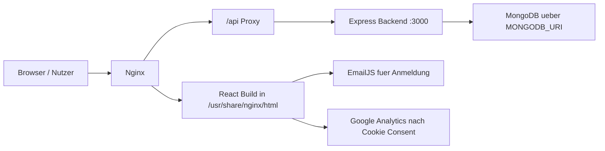
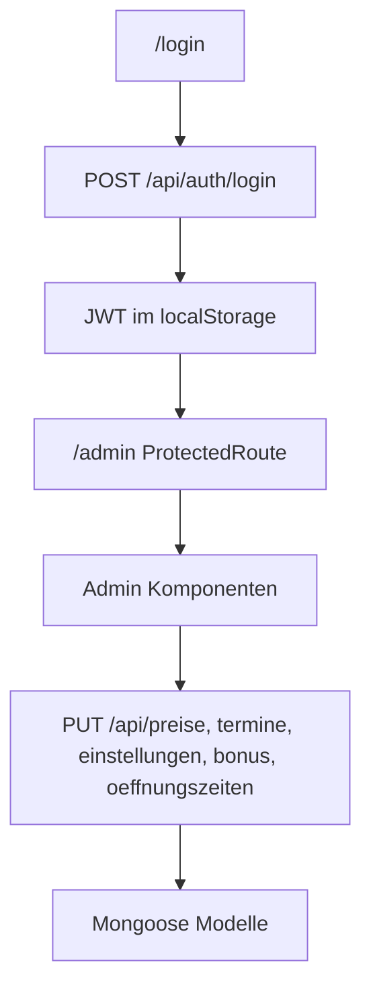
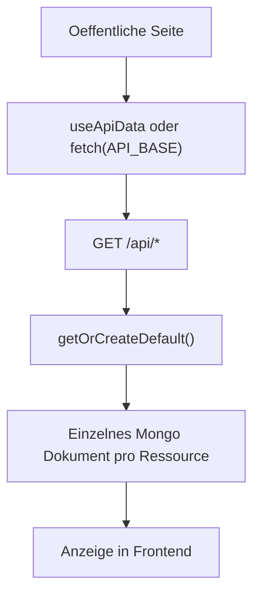

# Projektueberblick

## Zweck

Das Projekt ist eine Fullstack-Webseite fuer die Fahrschule Scooldrive Lueneburg. Es kombiniert eine oeffentliche Marketing- und Informationsseite mit einem Admin-Bereich, der dynamische Daten im Backend veraendert.

## Hauptsysteme

| Bereich | Rolle | Einstieg |
| --- | --- | --- |
| Frontend | React Single Page App mit oeffentlichen Seiten, Blog, Anmeldung und Admin UI | `client/src/App.jsx` |
| Backend | Express API fuer Admin-Login und dynamische Website-Daten | `server/src/app.js` |
| Datenbank | MongoDB ueber Mongoose-Modelle | `server/src/models/*.js` |
| Deployment | Docker Compose, Nginx, Certbot | `docker-compose.yml`, `nginx/nginx.conf` |

## Laufzeitbild

## Fachliche Faehigkeiten

- Oeffentliche Seiten fuer Fuehrerschein, Auto, Anhaenger, Motorrad, Theoriekurs, Intensivkurs, Preise und Punkteabbau.
- Mehrsprachigkeit fuer Deutsch, Englisch und Arabisch.
- SEO-Metadaten pro Seite ueber `react-helmet-async`.
- Blog aus statischen Artikeldaten in `client/src/helpers/blogarticles.js`.
- Anmeldeformular mit mehrstufigem Flow und EmailJS-Versand.
- Admin-Login per JWT.
- Admin-Verwaltung von Preisen, Terminen, Einstellungen, Boni und Oeffnungszeiten.
- Bonus-Ticker und Anmeldung-Stopp werden ueber Backend-Daten gesteuert.

## Wichtige Datenfluesse

