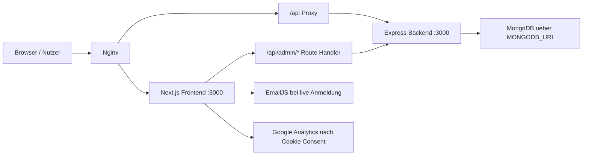
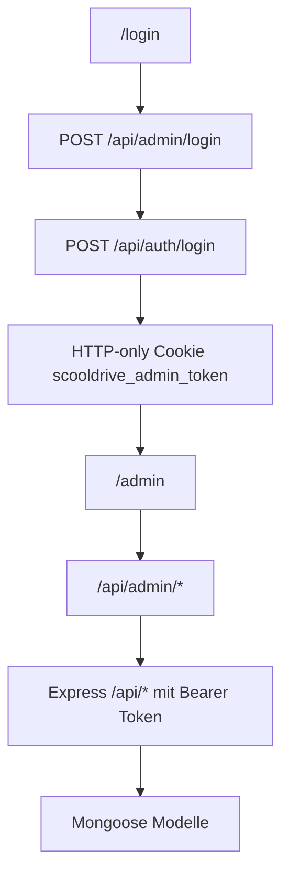
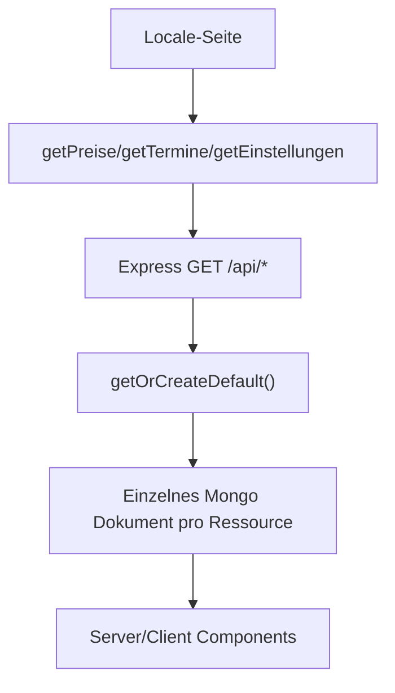

# Projektueberblick

## Zweck

Das Projekt ist eine Fullstack-Webseite fuer die Fahrschule Scooldrive. Es kombiniert mehrsprachige oeffentliche Informationsseiten, Blog, Anmeldung und einen geschuetzten Admin-Bereich fuer dynamische Website-Daten.

## Hauptsysteme

| Bereich | Rolle | Einstieg |
| --- | --- | --- |
| Frontend | Next.js 16 App Router mit oeffentlichen Seiten, Blog, Anmeldung und Admin UI | `client-next/app/` |
| Backend | Express API fuer Admin-Login, dynamische Website-Daten und Registrierungen | `server/src/app.js` |
| Datenbank | MongoDB ueber Mongoose-Modelle | `server/src/models/*.js` |
| Reverse Proxy | Nginx fuer HTTPS, Domain-Routing und API-Proxies | `nginx/nginx.conf` |
| Deployment | Docker Compose mit Frontend, Backend, Nginx und Certbot | `docker-compose.yml` |

## Laufzeitbild

## Fachliche Faehigkeiten

- Oeffentliche Seiten fuer Auto-Fuehrerschein, Auto-Anhaenger, Motorrad, Theoriekurs, Intensivkurs, Preise und Punkteabbau.
- Mehrsprachigkeit fuer Deutsch, Englisch und Arabisch ueber Locale-Routen `/{locale}`.
- SEO-Metadaten pro Seite ueber Next.js `generateMetadata`.
- Blog aus statischen, dateibasierten Artikeldaten unter `client-next/messages/{locale}/blogs`.
- Mehrstufige Anmeldung mit Speicherung in MongoDB und anschliessendem EmailJS-Statusabgleich.
- Admin-Login per Express-JWT, in Next als HTTP-only Cookie gehalten.
- Admin-Verwaltung von Preisen, Terminen, Einstellungen, Boni, Oeffnungszeiten und gespeicherten Registrierungen.
- Anmeldung-Stopp und WhatsApp-Sichtbarkeit werden ueber Backend-Daten gesteuert.

## Wichtige Datenfluesse

