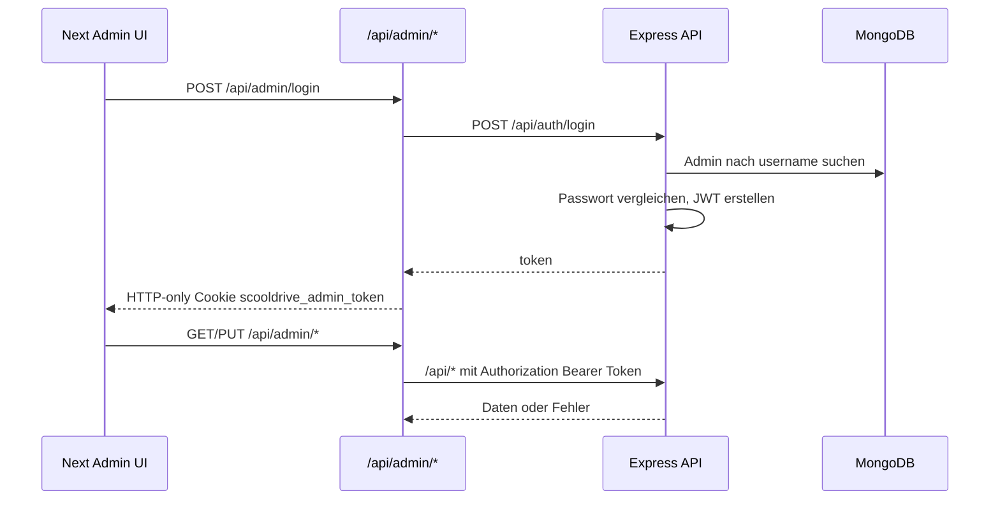

# Admin, Auth und Sicherheit

## Admin-Flow



## Frontend-Dateien

| Datei | Rolle |
| --- | --- |
| `client-next/app/login/page.tsx` | Redirect zu `/admin`, wenn bereits eingeloggt; sonst Loginformular. |
| `client-next/components/Admin/LoginForm.tsx` | Loginformular gegen `/api/admin/login`. |
| `client-next/app/admin/page.tsx` | `requireAdminSession()` und Dashboard. |
| `client-next/components/Admin/AdminDashboard.tsx` | Admin-UI fuer alle Ressourcen. |
| `client-next/components/Admin/api.ts` | `adminFetch()` mit Same-Origin-Credentials. |
| `client-next/lib/admin-auth.ts` | Cookie lesen, Express-Session verifizieren, Admin erzwingen. |
| `client-next/app/api/admin/_lib.ts` | Gemeinsamer Proxy zum Express-Backend. |

## Admin-Module

| Modul | Next-Route | Express-Ressource | Zweck |
| --- | --- | --- | --- |
| Einstellungen | `/api/admin/einstellungen` | `/api/einstellungen` | Anmeldung-Stopp, begrenzte Plaetze, Kontaktoptionen. |
| Bonus | `/api/admin/bonus` | `/api/bonus` | Allgemeiner Bonus und Freunde-Bonus. |
| Preise | `/api/admin/preise` | `/api/preise` | Preisfelder. |
| Termine | `/api/admin/termine` | `/api/termine` | Ein aktueller Termin. |
| Oeffnungszeiten | `/api/admin/oeffnungszeiten` | `/api/oeffnungszeiten` | Tageszeiten und Aktivstatus. |
| Registrierungen | `/api/admin/registrations` | `/api/registrations` | Gespeicherte Formular-Anmeldungen und Emailstatus. |

## Token-Speicher

Das Express-Backend erstellt weiterhin ein JWT. Die Next-App speichert dieses JWT aber nicht mehr in `localStorage`, sondern in einem HTTP-only Cookie:

```text
scooldrive_admin_token
```

Cookie-Optionen:

- `httpOnly: true`
- `secure: true` in Production
- `sameSite: "lax"`
- `path: "/"`

Die Client-Komponenten sprechen nur `/api/admin/*` an. Der Bearer Token wird serverseitig im Next Route Handler an Express weitergereicht.

## Backend-Sicherheit

- Admin-Passwoerter werden mit bcrypt gehasht.
- JWT-Token werden mit `JWT_SECRET` signiert.
- Token-Laufzeit kommt aus `JWT_EXPIRES_IN`.
- Account-Sperre nach 5 falschen Passwortversuchen fuer 30 Minuten.
- CORS erlaubt nur definierte Origins.
- Globales Rate Limiting ist aktiv.
- Ein strenger Auth-Limiter ist definiert, aber aktuell in `server/src/app.js` auskommentiert.

## Environment-Abhaengigkeiten

Backend:

- `MONGODB_URI`
- `JWT_SECRET`
- `JWT_EXPIRES_IN`
- `ADMIN_USERNAME`
- `ADMIN_PASSWORD`
- `ALLOWED_ORIGINS`
- `RATE_LIMIT_WINDOW_MS`
- `RATE_LIMIT_MAX_REQUESTS`
- `PORT`
- `NODE_ENV`

Frontend/Next:

- `API_BASE_URL`
- `NEXT_PUBLIC_API_URL`
- `NEXT_PUBLIC_EMAIL_MODE`
- `NEXT_PUBLIC_EMAILJS_SERVICE_ID`
- `NEXT_PUBLIC_EMAILJS_TEMPLATE_ID`
- `NEXT_PUBLIC_EMAILJS_PUBLIC_KEY`
- `NEXT_PUBLIC_GA_MEASUREMENT_ID`
