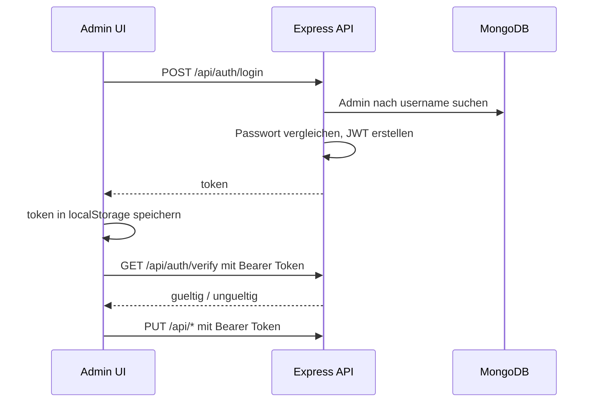

# Admin, Auth und Sicherheit

## Admin-Flow

## Frontend-Dateien

| Datei | Rolle |
| --- | --- |
| `client/src/pages/Admin/Login.jsx` | Loginformular, speichert JWT in `localStorage.token`. |
| `client/src/pages/Admin/ProtectedRoute.jsx` | Prueft Token ueber `/api/auth/verify`, leitet sonst zu `/login`. |
| `client/src/pages/Admin/AdminApp.jsx` | Rendert alle Admin-Module untereinander. |
| `client/src/pages/Admin/components/*.jsx` | GET/PUT-Formulare fuer einzelne Backend-Ressourcen. |

## Admin-Module

| Modul | Ressource | Zweck |
| --- | --- | --- |
| Einstellungen | `/api/einstellungen` | Anmeldung-Stopp, begrenzte Plaetze, Kontaktoptionen. |
| Bonus | `/api/bonus` | Allgemeiner Bonus und Freunde-Bonus. |
| Preise | `/api/preise` | Preisfelder. |
| Termine | `/api/termine` | Ein aktueller Termin. |
| Oeffnungszeiten | `/api/oeffnungszeiten` | Tageszeiten und Aktivstatus. |
| Registrierungen | `/api/registrations` | Gespeicherte Formular-Anmeldungen und Emailstatus. |

## Backend-Sicherheit

- Admin-Passwoerter werden mit bcrypt gehasht.
- JWT-Token werden mit `JWT_SECRET` signiert.
- Token-Laufzeit kommt aus `JWT_EXPIRES_IN`.
- Account-Sperre nach 5 falschen Passwortversuchen fuer 30 Minuten.
- CORS erlaubt nur definierte Origins.
- Globales Rate Limiting ist aktiv.
- Ein strenger Auth-Limiter ist definiert, aber aktuell in `app.js` auskommentiert.

## Environment-Abhaengigkeiten

Backend:

- `MONGODB_URI`
- `JWT_SECRET`
- `JWT_EXPIRES_IN`
- `ADMIN_USERNAME`
- `ADMIN_PASSWORD`
- `ALLOWED_ORIGINS`
- `RATE_LIMIT_WINDOW_MS`
- `RATE_LIMIT_MAX_REQUESTS`
- `PORT`
- `NODE_ENV`

Frontend:

- `VITE_API_URL`
- `VITE_EMAILJS_SERVICE_ID`
- `VITE_EMAILJS_TEMPLATE_ID`
- `VITE_EMAILJS_PUBLIC_KEY`
- `VITE_GA_MEASUREMENT_ID`

## Token-Speicher

Das Admin-Frontend speichert den JWT in `localStorage`. Das ist einfach und passend zur aktuellen SPA-Struktur, bedeutet aber: XSS-Schutz im Frontend ist besonders wichtig, weil ein Script den Token auslesen koennte.
